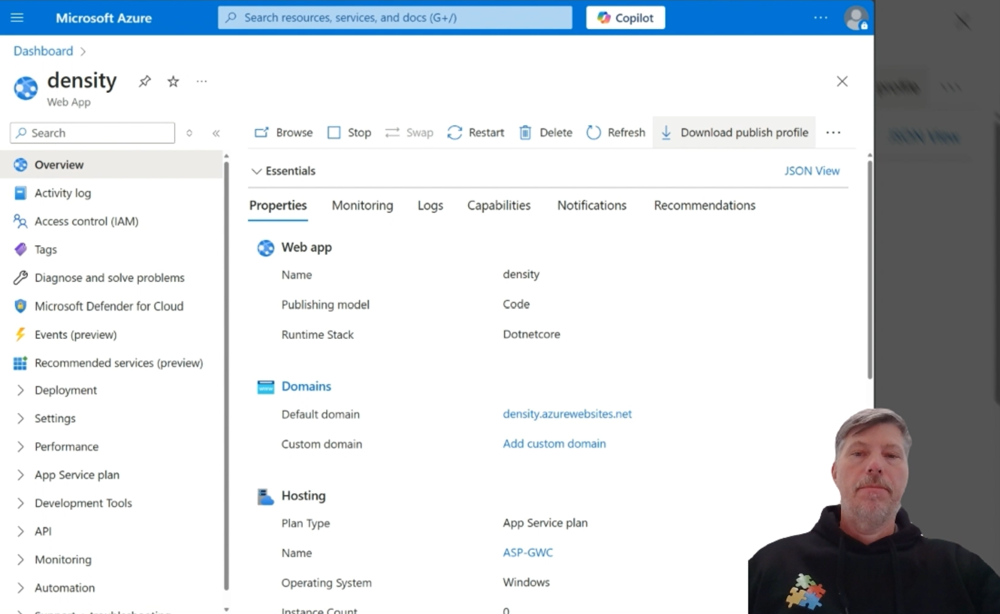
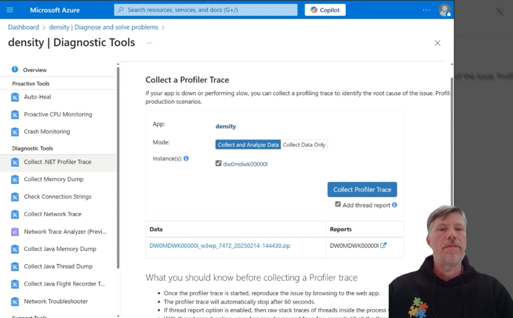
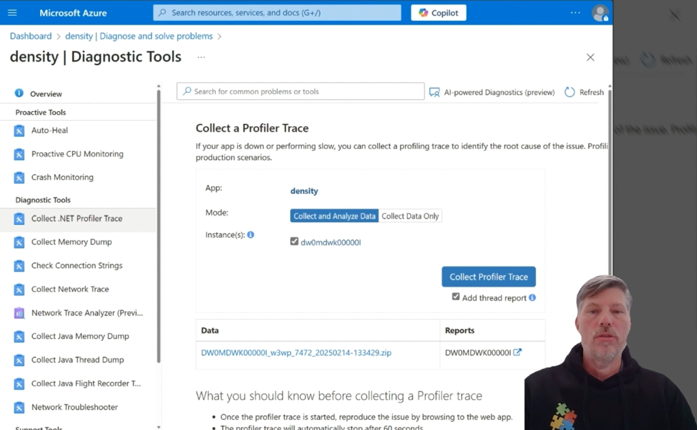

# Capture and analyze a .NET Profiler trace for High Cpu
This document provides instructional videos for capturing a Hihg Cpu .NET Profiler trace on an application running on Azure App Service.  How to then analyze it is also provided.

## How to capture a .NET Profiler Trace for High Cpu

## How to analyze an in-process .NET Profiler Trace for High Cpu

## How to analyze an out-of-process .NET Profiler Trace for High Cpu

